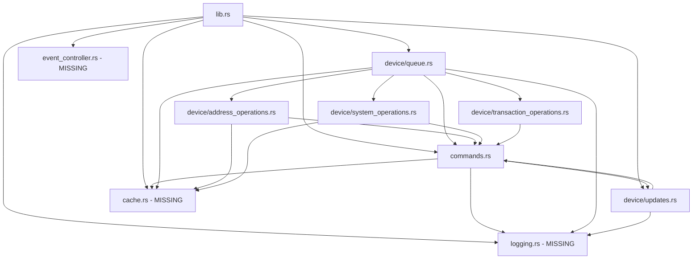

# Tauri Rust Codebase Analysis Report

## Executive Summary

This report provides a comprehensive analysis of the Tauri Rust codebase located at `/src-tauri/src`. The analysis reveals significant architectural issues, missing modules, and opportunities for refactoring.

### Critical Issues Found:
1. **Missing Core Modules**: Three critical modules (`logging`, `cache`, `event_controller`) are referenced throughout the codebase but their source files are missing
2. **Massive Monolithic File**: `commands.rs` contains 4,384 lines of code with 53+ command handlers
3. **Significant Code Duplication**: Queue operations are duplicated between `device/queue.rs` and `commands.rs`
4. **Unclear Module Boundaries**: No clear separation of concerns between command handlers and business logic

## Current Architecture Overview

### File Structure
```
src-tauri/src/
├── main.rs              (7 lines - entry point)
├── lib.rs               (135 lines - app setup and command registration)
├── commands.rs          (4,384 lines - MASSIVE monolithic command handlers)
├── device/
│   ├── mod.rs           (4 lines - module declarations)
│   ├── queue.rs         (1,185 lines - device queue implementation)
│   ├── address_operations.rs    (555 lines)
│   ├── system_operations.rs     (478 lines)
│   ├── transaction_operations.rs (271 lines)
│   └── updates.rs               (575 lines)
└── data/                (JSON configuration files)
```

### Missing Modules
The following modules are referenced but their files are missing:
- `logging` - Used for device request/response logging
- `cache` - Used for caching device operations and pubkeys
- `event_controller` - Used for managing frontend events

These modules exist in other versions of the project (v5, bitcoin-only) but are absent here.

## Module Dependencies Map

### Import Dependencies


### Circular Dependencies Identified
1. `commands.rs` ↔ `device/queue.rs`
2. `commands.rs` ↔ `device/*.rs` modules

## Identified Redundancies and Dead Code

### 1. Device Queue Management Duplication

**In `commands.rs`:**
- `get_or_create_device_queue()` (line 4274)
- `DeviceQueueManager` type alias
- Queue status tracking
- Device cleanup tracking

**In `device/queue.rs`:**
- `add_to_device_queue()` - Main queue entry point
- Duplicates queue management logic
- Has its own device state caching

### 2. Device Operation Handling Overlap

Both `commands.rs` and `device/queue.rs` handle:
- PIN flow management
- Device status evaluation
- Response caching
- Feature detection

### 3. Utility Function Duplication
- `parse_derivation_path()` - Defined in commands.rs but used across modules
- `parse_transaction_from_hex()` - Defined in commands.rs but used in queue.rs
- Feature conversion functions duplicated

### 4. Command Handler Redundancy

Many command handlers in `commands.rs` simply forward to device queue operations:
```rust
// Example pattern repeated dozens of times:
#[tauri::command]
pub async fn some_device_operation(...) -> Result<...> {
    // Get queue
    // Create request
    // Forward to queue
    // Return result
}
```

## Areas Where Queue and Commands Overlap

### 1. Request Processing Pipeline

**commands.rs handles:**
- Initial command reception
- Basic validation
- Queue retrieval
- Response formatting

**device/queue.rs handles:**
- Request validation (duplicated)
- Device state checking
- PIN flow management
- Actual device communication
- Response generation

### 2. State Management

Both modules maintain separate state for:
- Device connection status
- PIN flow tracking
- Response caching
- Device features

### 3. Error Handling

Error handling is inconsistent between modules:
- Different error types
- Duplicate error conversion logic
- Inconsistent logging patterns

## Recommendations for Refactoring

### 1. Immediate Critical Fixes

**a) Restore Missing Modules**
- Copy `logging.rs`, `cache.rs`, and `event_controller.rs` from a working version
- Or implement stub versions to make the code compile
- Add proper module declarations in lib.rs

**b) Fix Module Declaration Structure**
```rust
// In lib.rs, add:
mod commands;
mod device;
mod logging;      // Currently missing
mod cache;        // Currently missing  
mod event_controller; // Currently missing
```

### 2. Short-term Refactoring (1-2 weeks)

**a) Extract Shared Utilities**
- Create `utils.rs` module for shared functions:
  - `parse_derivation_path()`
  - `parse_transaction_from_hex()`
  - Feature conversion functions

**b) Consolidate State Management**
- Create a `state.rs` module for all application state
- Single source of truth for device states
- Unified PIN flow tracking

**c) Simplify Command Handlers**
- Commands should only handle parameter validation
- All device operations through queue module
- Remove duplicate validation logic

### 3. Medium-term Refactoring (1-2 months)

**a) Break Down commands.rs**
```
commands/
├── mod.rs
├── device_management.rs    // Device control commands
├── wallet_operations.rs    // Wallet/PIN commands
├── recovery_operations.rs  // Recovery/seed commands
├── preferences.rs          // App preferences
└── system.rs              // System/utility commands
```

**b) Implement Proper Service Layer**
- Create service modules that encapsulate business logic
- Commands become thin wrappers calling services
- Queue becomes internal implementation detail

**c) Standardize Error Handling**
- Create unified error types
- Implement proper error propagation
- Consistent error logging

### 4. Long-term Architecture (3+ months)

**a) Domain-Driven Design**
```
src/
├── domain/           // Core business logic
│   ├── device/
│   ├── wallet/
│   └── recovery/
├── infrastructure/   // External integrations
│   ├── keepkey_rust/
│   └── tauri/
├── application/      // Use cases
└── presentation/     // Tauri commands
```

**b) Event-Driven Architecture**
- Implement proper event bus
- Decouple modules through events
- Enable better testing and modularity

**c) Dependency Injection**
- Remove direct module dependencies
- Use traits for abstraction
- Enable better testing

## Code Quality Metrics

### Current Issues:
- **Cyclomatic Complexity**: Very high in queue.rs and commands.rs
- **Code Duplication**: ~20-30% duplicated logic
- **Module Coupling**: Extremely high due to circular dependencies
- **Test Coverage**: Unable to determine (no test files found)

### Recommended Targets:
- Max file size: 500 lines
- Max function size: 50 lines
- Max cyclomatic complexity: 10
- Module coupling: <5 dependencies per module

## Conclusion

The codebase shows signs of rapid growth without proper architectural planning. The missing modules suggest incomplete migration or merging from another codebase. The massive `commands.rs` file and significant duplication between queue and command handlers indicate an urgent need for refactoring.

### Priority Actions:
1. **Fix compilation**: Add missing modules
2. **Reduce duplication**: Consolidate queue/command logic
3. **Break down monolith**: Split commands.rs
4. **Improve architecture**: Implement proper separation of concerns

The current architecture is functional but difficult to maintain and extend. Following the recommended refactoring plan will significantly improve code quality, maintainability, and developer experience.